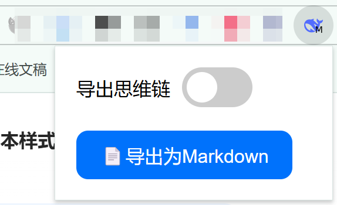

<a href="./README.md">简体中文</a> | English

Export DeepSeek Dialogs to Markdown

## Features

Original Dialog / Exported Text(typora theme: [bluetex](https://github.com/DaYangtuo247/typora-blueTex-theme))：

## Usage

### 1. Load unzipped files

1. Open the Chrome browser's load extension page [chrome://extensions/](chrome://extensions/)

2. Load unzipped files。Suppose the directory I download is `D:\code\github\deepseek2markdown`，Open `D:\code\github\deepseek2markdown\src` and click “Choose the folder”，load contents of the folder.

3. Pin the plugin to the plug-in bar

**Attention: You should refresh the DeepSeek web page before loading the plug-in for the first time.**

4. Click on the button to extract the current conversation Markdown file, you can check whether to export the chain of thought

### 2. install .crx

The extension is not yet available in chrome extension store. Method 1 is recommended.

After you have unzipped .crx, follow method 1

## TODOs

v0.1

- [x] Beautify popup.html
- [x] Optimize the markdown text formatting
- [x] Choose whether or not to export the thought chain
- [x] Optimizing styles for code export
- [x] Support for exporting tables
- [x] Support for exporting images
- [x] Optimizing export styles for multi-level lists

## Feedback and contribution

If you encounter problems in the process of using or have suggestions for improvement, welcome to submit Issue or PR

## Acknowledgement

[DeepSeek-Chat-Exporter](https://github.com/blueberrycongee/DeepSeek-Chat-Exporter)
