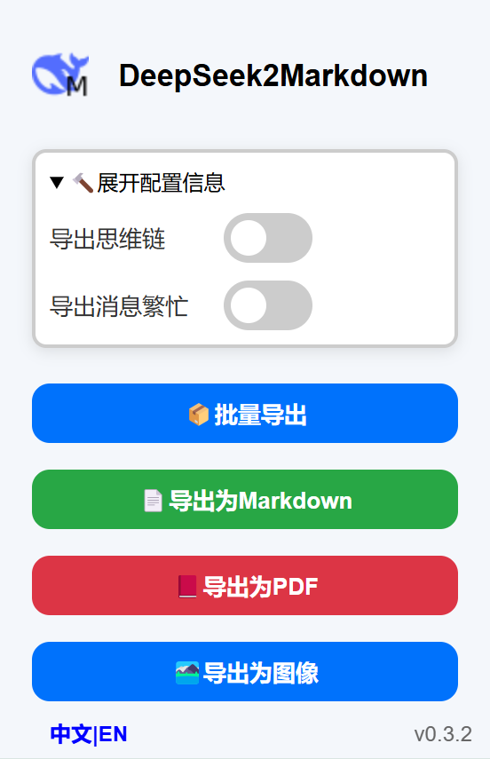
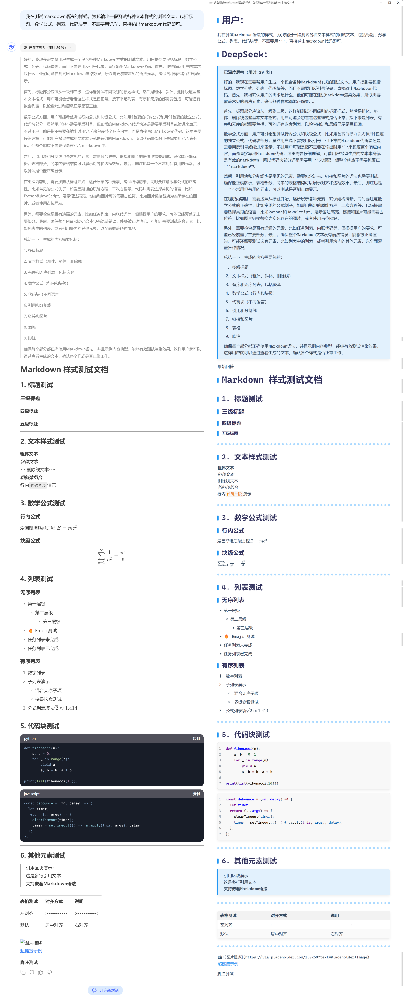
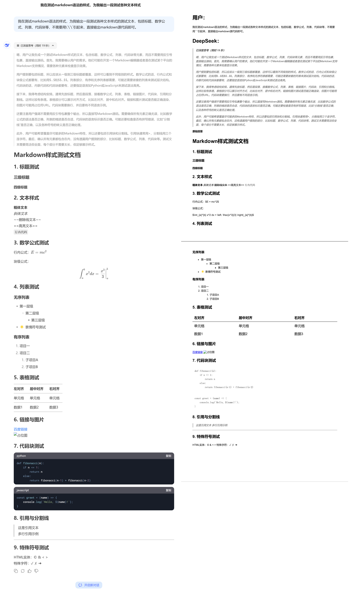
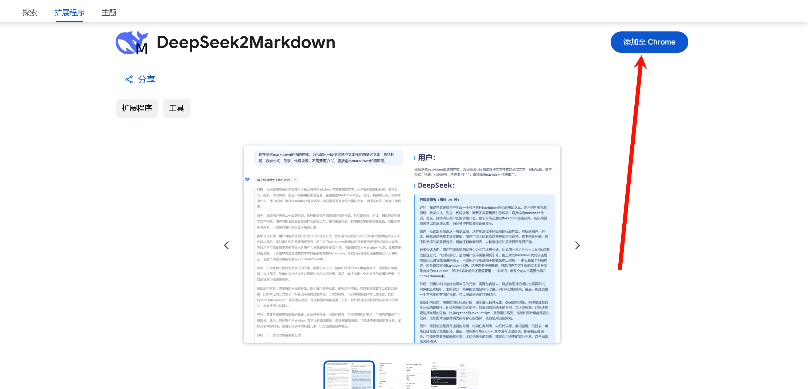
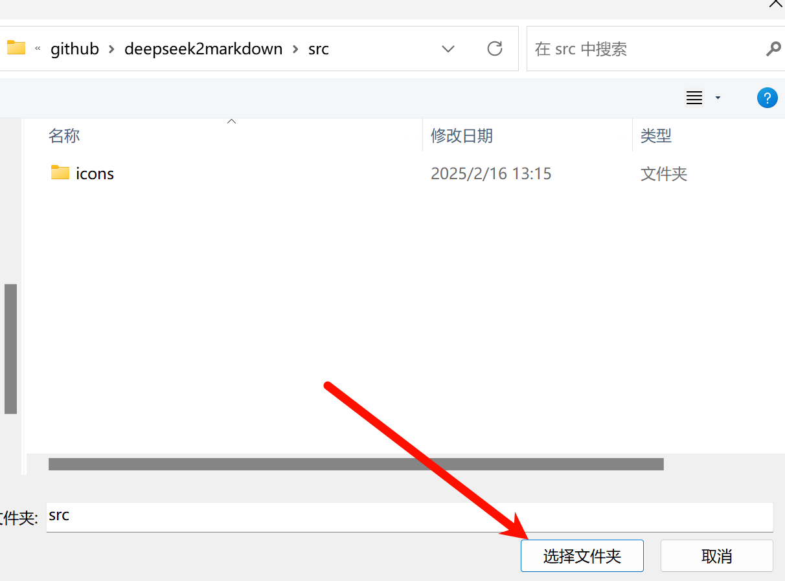
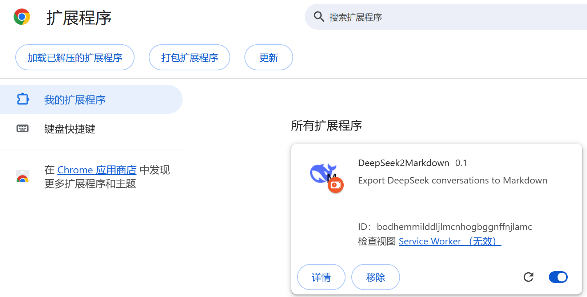
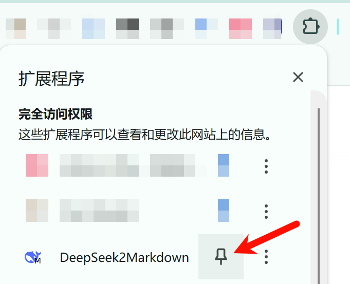

<a href="./README.md">简体中文</a> | English

Export DeepSeek conversations to Markdown files

[Chrome Web Store](https://chromewebstore.google.com/detail/deepseek2markdown/jfolcdbejlennfldgbninbjglbahaejn)

> If the button does not respond, please refresh the page and try again.

## Features

Plugin interface

>If the code blocks do not display correctly when exporting images, try exporting again.

Original conversation / Exported Markdown text (typora theme is bluetex):

Original conversation / Exported PDF

Original conversation / Exported image

 

## Usage

### Method 1: Download directly from the [Chrome Store](https://chromewebstore.google.com/detail/deepseek2markdown/jfolcdbejlennfldgbninbjglbahaejn)

[link](https://chromewebstore.google.com/detail/deepseek2markdown/jfolcdbejlennfldgbninbjglbahaejn)

### Method 2: Load unpacked files

1. Open the Chrome browser's extension loading page chrome://extensions/

2. Load the unpacked extension. Assuming the downloaded directory is D:\code\github\deepseek2markdown, you should open D:\code\github\deepseek2markdown\src and click "Select Folder" to load the contents of the src folder.

 

3. Pin the plugin in the plugin bar

**Note: If you have opened the DeepSeek webpage before using the plugin for the first time, you should refresh it first.**

 

4. Click the button to extract the current conversation's markdown file. You can choose whether to export the thought chain.

## To-Do List

- [ ] Support exporting to PDF
    - [x] Titles, thought chains, text styles (bold, italic, strikethrough), lists, tables, links and images, code, quotes, dividers, special symbols
    - [ ] Code block style optimization, support for formula export, support for highlighted text

v0.3

- [x] Support exporting specific messages from a conversation (custom selection of paragraphs, export only questions or answers)
- [x] Popup supports switching between Chinese and English

v0.2

- [x] Support strict mode Markdown export
- [x] Support filtering out server busy messages
- [x] Added image export function

v0.1

- [x] Popup interface beautification
- [x] Optimized markdown text export format
- [x] Option to export thought chain
- [x] Optimized code export style
- [x] Support for exporting tables
- [x] Support for exporting images
- [x] Optimized export style for multi-level lists

## Feedback and Contributions

If you encounter any issues or have suggestions for improvement, please feel free to submit an Issue or PR.

## Acknowledgments

[DeepSeek-Chat-Exporter](https://github.com/blueberrycongee/DeepSeek-Chat-Exporter)

