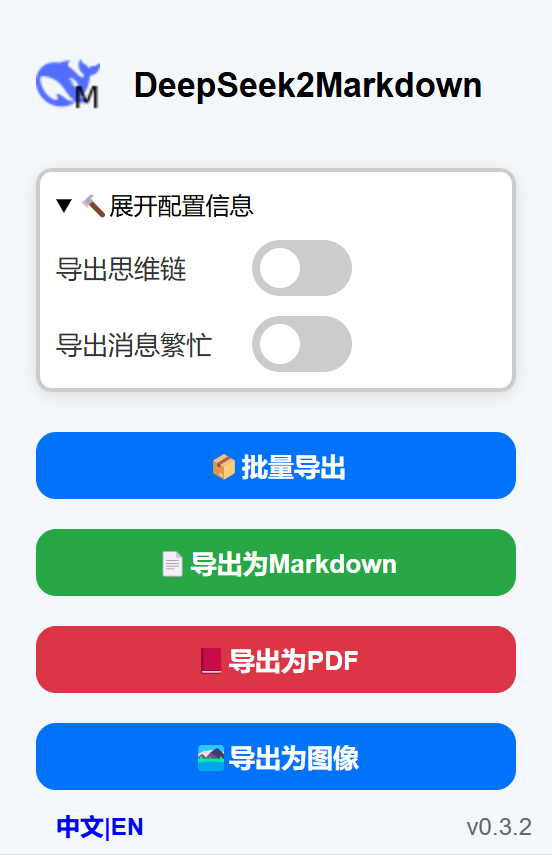
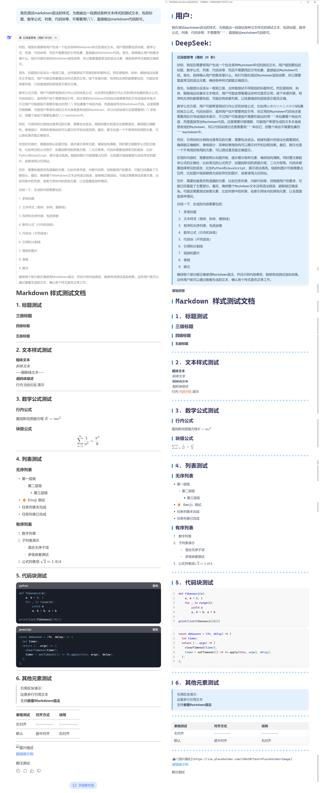
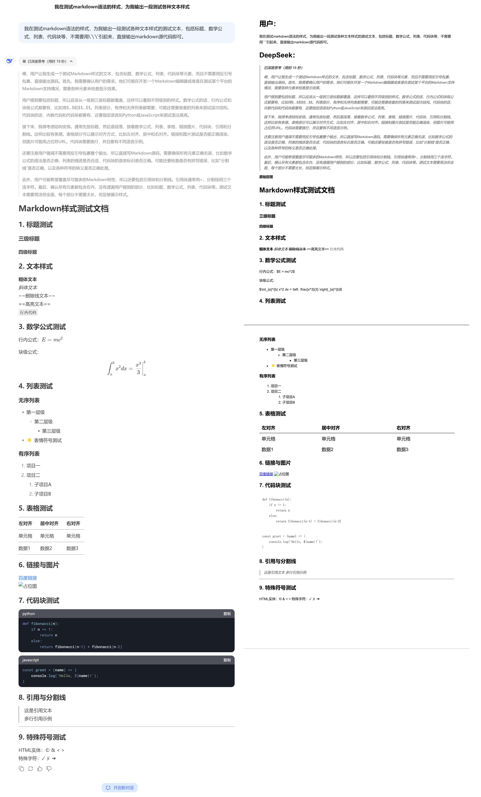
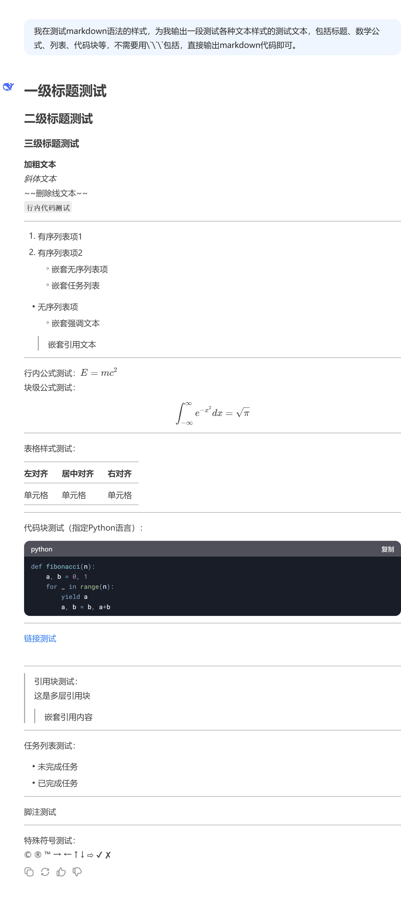
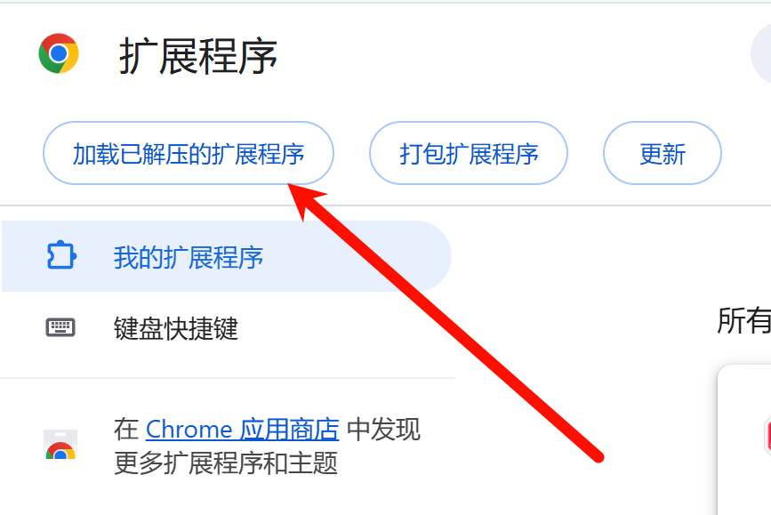
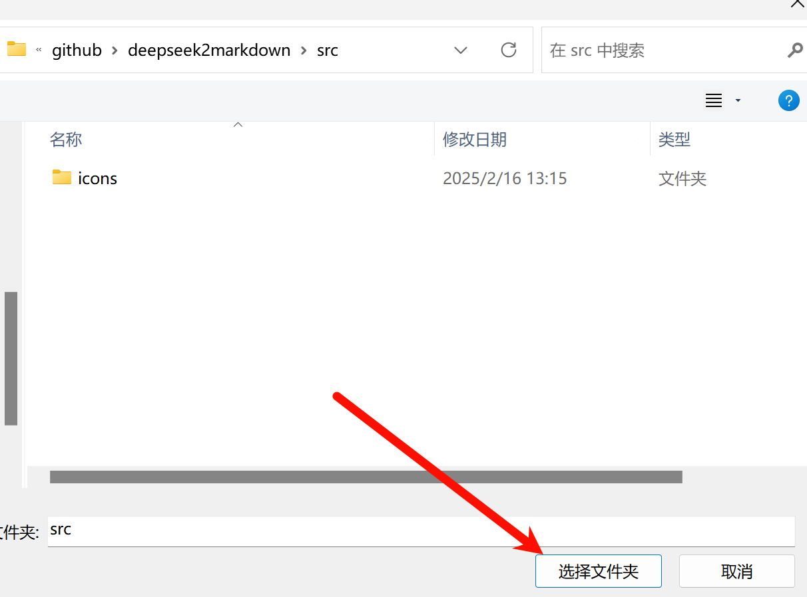
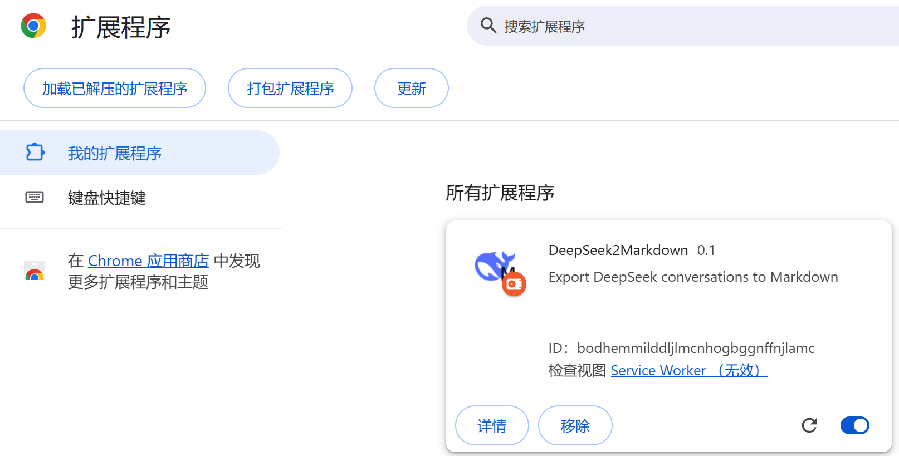
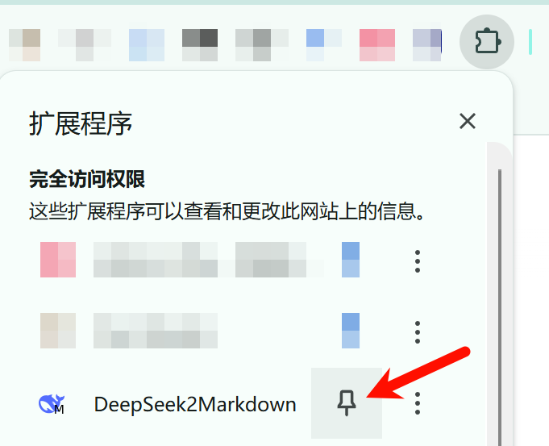

简体中文 | <a href="./README-en.md">English</a>

导出DeepSeek的对话到Markdown文件

> 如果点击按钮没反应，请直接刷新页面后进行尝试。

## 特性

插件界面

> 导出图像的时候如果代码块显示不正常，可以尝试重新导出。

原始对话 / 导出Markdown文本(typora主题为[bluetex](https://github.com/DaYangtuo247/typora-blueTex-theme))：

原始对话 / 导出PDF

原始对话 / 导出图像

## 使用方法

### 方法一：加载已解压的文件

1. 打开Chrome浏览器的加载扩展程序页面 [chrome://extensions/](chrome://extensions/)

2. 加载已解压的扩展程序。假设我下载的目录为D:\code\github\deepseek2markdown，则应该打开D:\code\github\deepseek2markdown\src 并点击“选择文件夹”，加载src文件夹中的内容。

3. 在插件栏固定插件

**注意：首次加载插件使用之前如果打开了DeepSeek的网页，应该先刷新一下。**

4. 点击按钮提取当前对话的markdown文件，可勾选是否导出思维链

### 方法二：安装crx文件

应用暂未上架chrome extension store，建议使用方法一。

安装方法为解压crx之后，按照方法一执行。

## 待办事项

- [ ] 支持导出为PDF
    - [x] 标题、思维链、文本样式（粗体、斜体、删除线）、列表、表格、链接和图片、代码、引用、分割线、特殊符号
    - [ ] 代码块样式优化、支持公式导出、支持高亮文本

v0.3

- [x] 支持选择一段对话中的特定消息导出（自定义选择段落、只导出提问或者回答）
- [x] Popup界面支持中英文切换

v0.2

- [x] markdown严格模式导出
- [x] 支持过滤掉服务器繁忙的消息
- [x] 添加图片导出功能

v0.1

- [x] popup界面美化
- [x] 导出markdown文本格式优化
- [x] 可选择是否导出思维链
- [x] 优化代码导出样式
- [x] 支持导出表格
- [x] 支持导出图片
- [x] 优化多层列表的导出样式

## 反馈与贡献

如果您在使用过程中遇到问题或有改进建议，欢迎提交 Issue 或 PR

## 致谢

[DeepSeek-Chat-Exporter](https://github.com/blueberrycongee/DeepSeek-Chat-Exporter)
